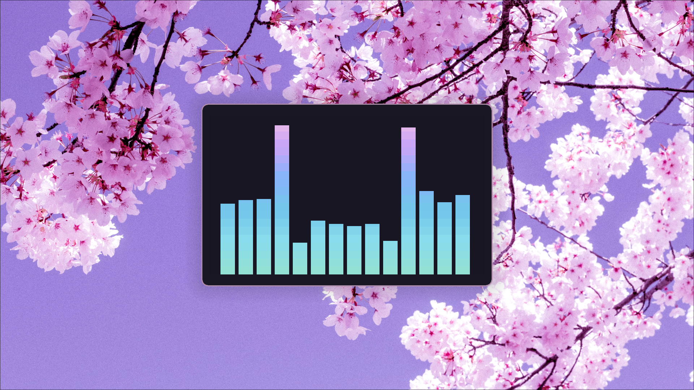
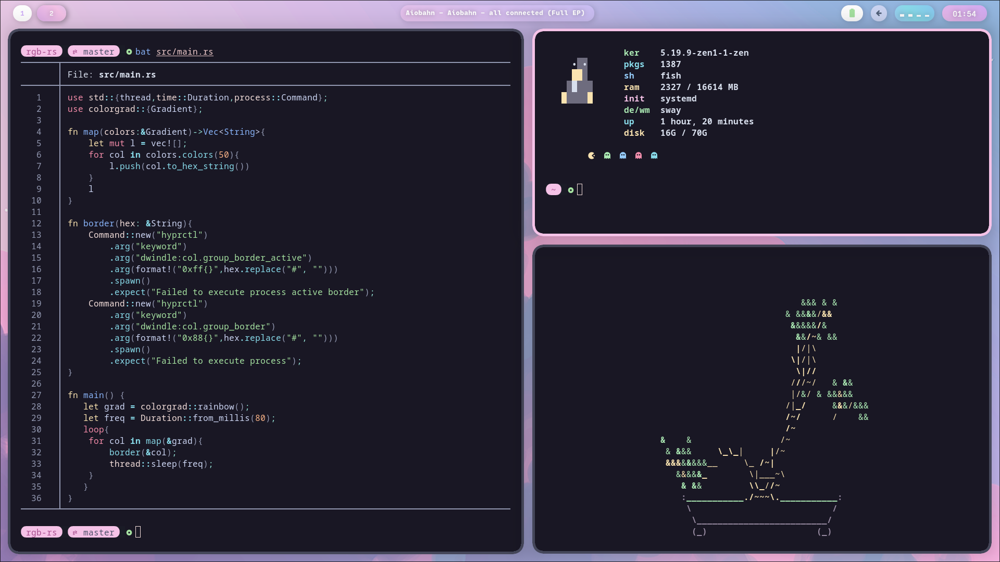

<div align="justify">

<div align="center">

```ocaml
 ✨ hyprland / dreamy / catppuccin ✨
```


# gallery


</div>
</div>


https://user-images.githubusercontent.com/77581181/191730195-56fa4616-59ac-4dae-a64a-2fe95fa8cdc3.mp4

<div align="justify">

<div align="center">

# installation
 
<hr>
 
</div>
</div>

## Arch
dependancies
```
hyprland-git waybar-hyprland-git cava waybar-mpris-git python rustup kitty fish wofi xdg-desktop-portal-wlr tty-clock-git swaylockd grim slurp pokemon-colorscripts-git starship jq dunst wl-clipboard swaylock-effects-git
```
using `paru`
```
paru -S hyprland-git waybar-hyprland-git cava waybar-mpris-git python rustup kitty fish wofi xdg-desktop-portal-wlr tty-clock-git swaylockd grim slurp pokemon-colorscripts-git starship jq dunst wl-clipboard swaylock-effects-git
```

## moving config files

```bash
git clone -b dreamy https://github.com/flick0/dotfiles
cd dotfiles
cp -r ./config/* ~/.config
```

## additional setup

```bash
touch ~/.config/hypr/store/dynamic_out.txt
touch ~/.config/hypr/store/prev.txt
touch ~/.config/hypr/store/latest_notif

chmod +x ~/.config/hypr/scripts/tools/*
chmod +x ~/.config/hypr/scripts/*
chmod +x ~/.config/hypr/*
```

## building the tools used in this rice

`swww` | wallpaper changer/daemon
```bash
git clone -b huge_changes https://github.com/flick0/swww
cd swww
cargo build --release
cp ./target/release/swww ~/.config/hypr/scripts/tools/
```

`rgb-borders` | rgb borders for grouped windows
```bash
git clone https://github.com/flick0/rgb-rs
cd rgb-rs
cargo build --release
cp ./target/release/rgb ~/.config/hypr/scripts/
```


# extras

## vscode custom css

you will need the `custom css and js loader` extension, you can get it from [here](https://marketplace.visualstudio.com/items?itemName=be5invis.vscode-custom-css)

make a new css file anywhere that fits you
then copy the following css to the file

```css
.tab.active {
    border: 4px solid #f5c2e7 !important;
    color: #f5c2e7 !important;
}
.tab{
    font-weight: 700 !important;
    border-radius: 12px !important;
    margin: 5px !important;
    padding-bottom: 2px !important;
    height: 45px !important;
    border:3px solid #313244 !important;
    background-color: #1e1e2e !important;
}
.tabs-container{
    height: auto !important;
    padding: 5px !important;
}
```

allow modifications to vscode by running the following command pointing to your vscode installation
```bash
sudo chown -R {your username} /opt/visual-studio-code-insiders/
```
> replace visual-studio-code-insiders with your vscode installation,
> you can find your installation dir by doing `whereis code` on your terminal


then open the vscode `settings.json` file (you shud be able to open it from `ctrl` + `shift` + `p` and searching for `Open User Settings(JSON)`)
then add the following to the file

```json
"vscode_custom_css.imports": [
    "file:///{path_to_file}"
],
```

then finally to apply the changes, open the command pallette(`ctrl`+`shift`+`p`) and search for `Enable Custom CSS and JS`


<hr>

*lmk if anything is broken on the repo*


