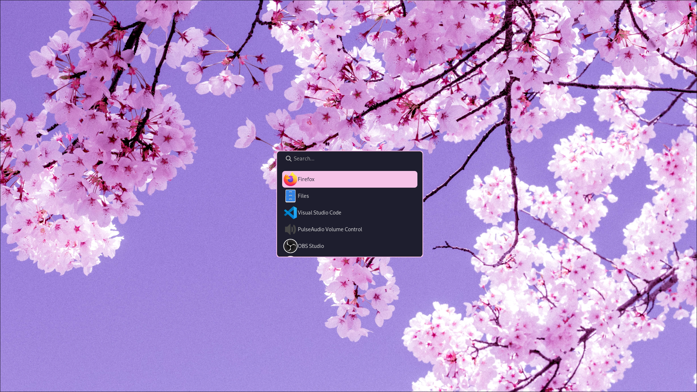
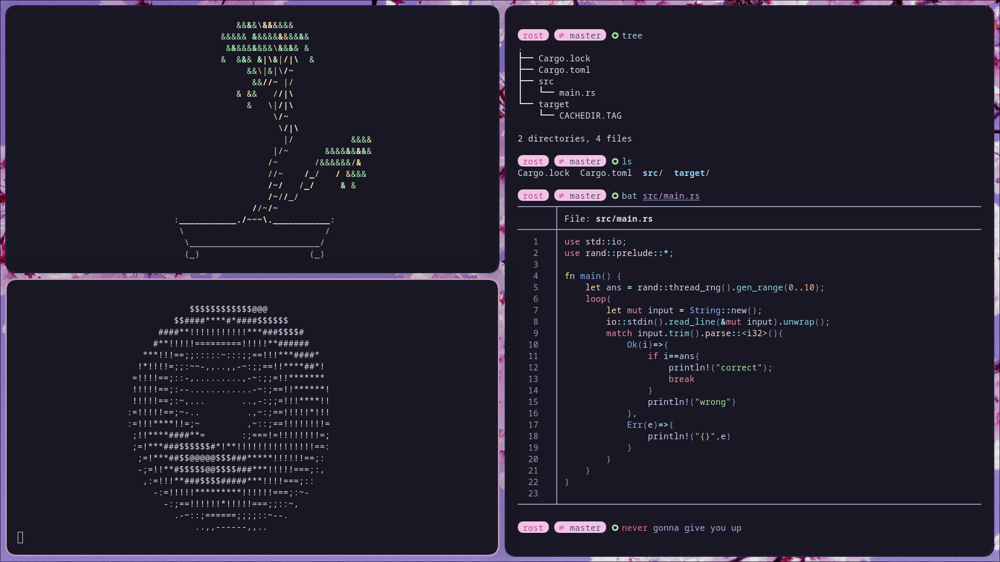

<div align="justify">

<div align="center">

```ocaml
 🌸 hyprland / cherry / blossom 🌸
```

<br>
<br>
<br>
<br>

</div>

## install (arch only)

**⚠️ USE SCRIPT AT YOUR OWN RISK, ID RECOMEND USING THE SCRIPT AS A REFERENCE ⚠️**

> you will need `paru` before running the script

```bash
git clone -b cherry-blossom https://github.com/flick0/dotfiles
cd cherry-blossom
chmod +x ./install
./install
```