<div>
    
</div>

<div align="right">
        do check out the full showcase vid here ~>
        <a href="https://www.youtube.com/watch?v=YRDbhWHF8bY">
            
        </a>
        <a href="https://www.reddit.com/r/unixporn/comments/18zwfhj/hyprland_yorha/">
            
        </a>
</div>


# 👾 YoRHa

A rice inspired by `NieR:Automata` ui


## 📥 Installation
> [!IMPORTANT]
> you need to install the base config found in [master branch](https://github.com/flick0/dotfiles) before installing this (unless you are using the install script)

- ## Manual
    - ### Dependancies
        #### Arch
        > ```sh
        > paru -S hyprland-git foot grim swww-git fish theme.sh aylurs-gtk-shell-git sassc starship cava imagemagick hyprland-plugin-hyprbars-git
        > ```
        #### STTT
        > install from https://github.com/flick0/sttt
    - ### Clone to theme folder
      ```sh
      mkdir ~/.config/hypr/themes && git clone -b hyprland-yorha https://github.com/flick0/dotfiles ~/.config/hypr/themes/yorha
      ```  
    
    - ### Apply theme
      
      - manual
         > change the `$THEME` variable in hyprland conf to `./themes/yorha`
      
      - hyprtheme
         > soon

- ## Install Script
    ```sh
    curl -s -L https://raw.githubusercontent.com/flick0/dotfiles/hyprland-yorha/install.sh | bash
    ```
    > provided by [@cutieqt1](https://discord.com/channels/@me/1193218215380254740) on discord

## ✨ Features
 - ### Music Widget
   > https://github.com/flick0/dotfiles/assets/77581181/4c10b974-11e1-41c2-89fe-3a1cfb405fd6

 - ### Slurp clone made in ags
   > https://github.com/flick0/dotfiles/assets/77581181/efd9363e-47f4-4768-bdd9-3d8d15e5a9c4

 - ### Light/Dark mode with transitions
   > https://github.com/flick0/dotfiles/assets/77581181/663c9a12-ff65-4130-aa19-7c38cb6e90e6


## Thanks to
- https://www.platinumgames.com/official-blog/article/9624 amazing blog by the creators of NieR:Automata
- https://github.com/accrazed/YoRHA-UI-BetterDiscord (for the wallpapers)
- https://codepen.io/RobotsPlay/pen/bGeNGdx (few svgs and for reference)
