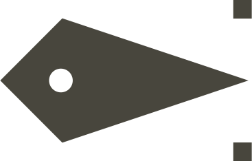

    

        
        
&nbsp;&nbsp;&nbsp;&nbsp;&nbsp;

        
    

</dib>

# WIP

:0

> you need the base configs installed from the master branch, this is only a theme (no keybinds, etc )

## these stuff helped

https://github.com/Beinsezii/NieR-Cursors

https://github.com/accrazed/YoRHA-UI-BetterDiscord

https://codepen.io/RobotsPlay/pen/bGeNGdx
